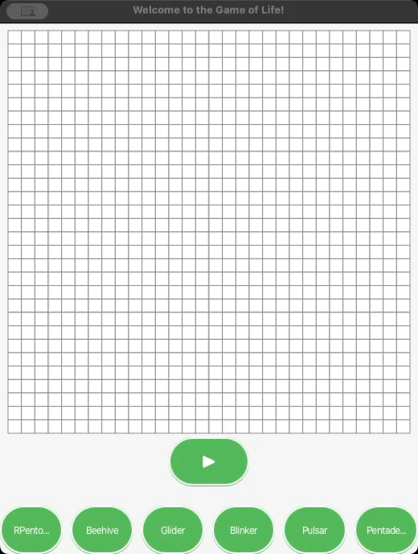
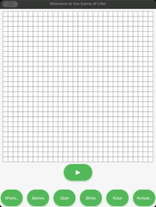
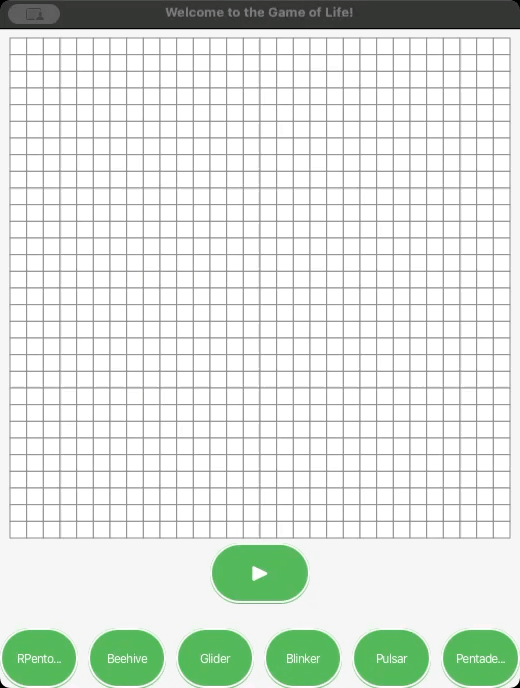

# Game of Life

## Overview
The Game of Life, also known simply as Life, is a cellular automaton devised by the British mathematician John Horton Conway in 1970. It is a zero-player game, meaning that its evolution is determined by its initial state, requiring no further input. One interacts with the Game of Life by creating an initial configuration and observing how it evolves.

## Rules
The game evolves on a grid of square cells, each cell being in one of two possible states:
- **Alive**: An occupied cell.
- **Dead**: An empty or unoccupied cell.

The state of each cell changes in discrete time steps. The states of all of the cells at one time are updated based on the following rules:
1. Any live cell with fewer than two live neighbors dies, as if by underpopulation.
2. Any live cell with two or three live neighbors lives on to the next generation.
3. Any live cell with more than three live neighbors dies, as if by overpopulation.
4. Any dead cell with exactly three live neighbors becomes a live cell, as if by reproduction.

## Starting Formations
Below are some of the well-known starting formations that show interesting behaviors:

### RPentomino
A small pattern that evolves quickly and has a chaotic evolution.

### Beehive
A stable pattern that does not change from one generation to the next.

### Glider
A small pattern that travels across the board.

### Blinker
The simplest and smallest oscillator.

### Pulsar
A larger oscillator with a period of 3.

### Pentadecathlon
An oscillator with a period of 15, known for its unique interactions.

## How to Use
1. Clone the repository to your local machine.
2. Run the application to initialize the Game of Life grid.
3. Select a starting formation from the provided options or create a new one.
4. Observe how the formation evolves over generations.

## Technologies
- JavaFX for the GUI
- Java for backend processing

## Contributing
Contributions to this project are welcome. Please fork the repository and submit a pull request with your changes or improvements.

## License
Distributed under the MIT License. See `LICENSE` for more information.
