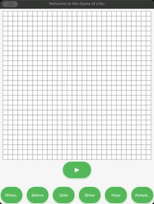
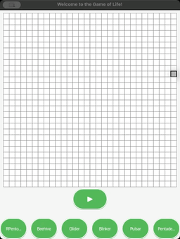
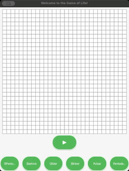

# Game of Life

## Overview
[The Game of Life](https://en.wikipedia.org/wiki/Conway%27s_Game_of_Life), also known as Life, is a cellular automaton devised by the British mathematician John Horton Conway in 1970. It is a zero-player game, meaning that its evolution is determined by its initial state, requiring no further input. One interacts with the Game of Life by creating an initial configuration and observing how it evolves.
This project is an implementation of Game of Life that uses the [Social Game System](https://github.com/ishayankoo001/Social-Game-System) as the core for the processes of the game. each Cell is considered as a Player in SGS that can send messages to its neighbors (8 in the case of this project) to indicate whether it's alive or not.

## Rules
The game evolves on a grid of square cells, each cell being in one of two possible states:
- **Alive**: An occupied cell.
- **Dead**: An empty or unoccupied cell.

The state of each cell changes in discrete time steps. The states of all of the cells at one time are updated based on the following rules:
1. Any live cell with fewer than two live neighbors dies, as if by underpopulation.
2. Any live cell with two or three live neighbors lives on to the next generation.
3. Any live cell with more than three live neighbors dies, as if by overpopulation.
4. Any dead cell with exactly three live neighbors becomes a live cell, as if by reproduction.

## Starting Formations
Below are some of the well-known starting formations that show interesting behaviors:

### Custom Formation
You can choose any starting formation of your choice by clicking on the cells to make them alive or dead.

### RPentomino
A small pattern that evolves quickly and has a chaotic evolution.

### Beehive
A stable pattern that does not change from one generation to the next.

### Glider
A small pattern that travels across the board.

### Blinker
The simplest and smallest oscillator.

### Pulsar
A larger oscillator.

### Pentadecathlon
An oscillator with a period of 15, known for its unique interactions.

## Technologies
- JavaFX for the GUI
- Java for backend processing

## Contributing
Contributions to this project are welcome. Please fork the repository and submit a pull request with your changes or improvements.

## License
Distributed under the MIT License. See `LICENSE` for more information.
